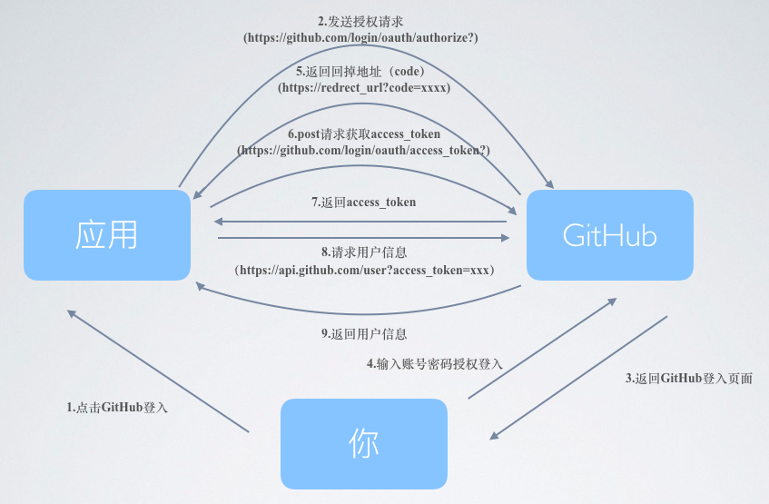

# 总体流程及流程图  
主要分三步，请求code，请求access_code,请求详细信息  

文档地址: https://developer.github.com/apps/building-oauth-apps/authorization-options-for-oauth-apps/  
# 具体实现过程  
* history中间件有'history/createHashHistory'和'history/createBrowserHistory'两种，createBrowserHistory这种方式直接刷新页面在线上环境会报错，所以采用createHashHistory，但这也给登录重定向带来一系列问题  
* 在github/settings/applications中填入回调地址，这个回调地址要为redirect_url(存在的话)的子串(或相等)  
* 登录返回的access_code和json数据持久化存储到local_storage中  
* 首先，在Header中判断local_storage中相关数据的存在，存在则显示，不存在则发出第一个action请求code，这个action带一个当前页面地址值作为参数，之后赋给redirect_url，可以达到当前页面登录，当前页面登录返回的效果，在header中发出请求登录的action，在container中带上当前页面的网址链接，达到当前页面不跳转的效果    
* 在saga的相关函数中进行这个action的处理，这里就涉及到createHashHistory的问题，它会插入#符号当做锚点，但是github后端接口会直接截断#后的东西，造成我们带的url只有前面一段，解决办法为
```const a = action.redirect_uri.replace("#", "%23!")
```
具体解释看:http://www.ruanyifeng.com/blog/2011/03/url_hash.html  
* 之后github会返回这种形式的url  http://localhost:9000/?code=013b82bb5f21794eb632#/!/articlesListPage/，接着拼接所需表单即可。这里不需要处理#了，因为是在表单中而不是url中  
* 在最外层的App.js中componentWillMount中加入判断登录，进行返回地址的判断，如果有带参数地址返回，并且localstorage为空，则说明需要登录，发出相应action，saga处理
# 跨域问题汇总  
跨域请求纯前端最终的解决办法:使用一个后端代理，不论是webpac-dev-server还是公开的cors-anywhere.herokuapp.com